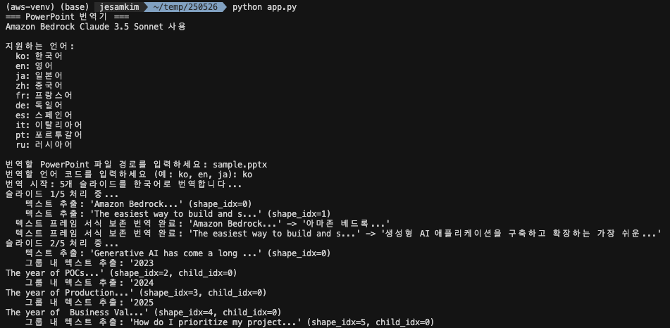
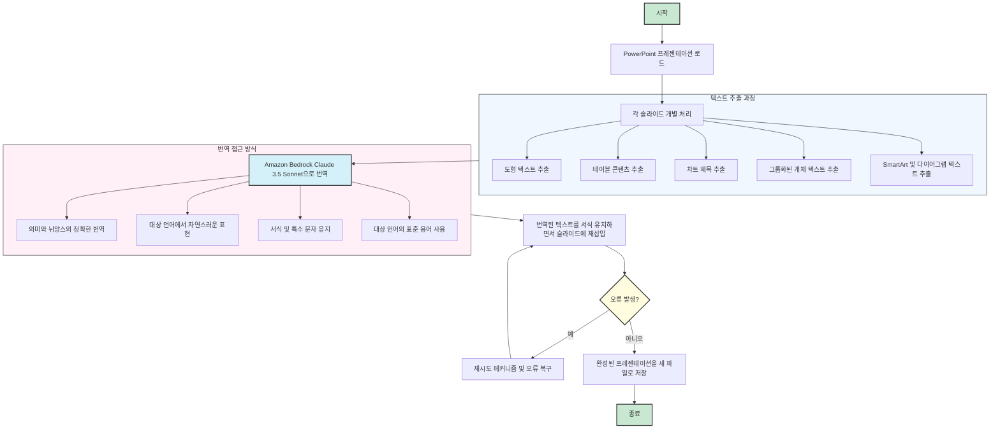

# PowerPoint 번역 도구 (Amazon Bedrock LLM 활용)

Amazon Bedrock의 LLM을 활용하여 PPTX 의 슬라이드 내용을 번역 합니다.

## 개요

이 도구는 Amazon Bedrock의 Claude 3.5 Sonnet 모델을 사용하여 PowerPoint 프레젠테이션을 자동으로 번역합니다. 다음과 같은 요소들의 서식을 유지하면서 PowerPoint 슬라이드의 텍스트를 번역할 수 있습니다:
- 도형 내 일반 텍스트
- 그룹화된 도형
- 테이블 내용
- 차트 제목
- SmartArt 및 기타 다이어그램

## 주요 기능

- **포괄적인 텍스트 추출**: 도형, 테이블, 차트, 그룹화된 개체 등 다양한 PowerPoint 요소에서 텍스트 추출
- **서식 유지**: 번역 과정에서 텍스트 서식(글꼴 스타일, 단락 서식 등) 유지
- **다중 언어 지원**: 10가지 다른 언어 간 번역 지원
- **강력한 오류 처리**: API 제한에 대한 재시도 메커니즘 및 오류 복구 기능
- **상세한 진행 보고**: 번역 과정 중 단계별 진행 정보 제공

## 한계점 및 고려사항

이 도구는 대부분의 PowerPoint 프레젠테이션을 효과적으로 번역하지만, 다음과 같은 한계점이 있습니다:

- **복잡한 슬라이드**: 한 슬라이드에 텍스트 박스가 너무 많은 경우 일부 텍스트 요소가 제대로 번역되지 않을 수 있습니다
- **폰트 정보**: 특정 상황에서 일부 텍스트의 폰트 정보가 누락될 수 있습니다
- **완전한 번역**: 복잡한 구조나 특수 문자가 많은 슬라이드의 경우 번역이 부분적으로만 적용될 수 있습니다

### 다른 번역 도구와의 비교

다양한 PowerPoint 번역 도구가 있으나, 대부분은 다음과 같은 제약사항이 있습니다:
- 파일 크기 제한(일반적으로 20~100MB)
- 민감한 프레젠테이션 파일을 외부 서버에 업로드 필요

이 코드의 주요 장점은 **로컬 환경에서 실행**되므로 민감한 정보가 포함된 프레젠테이션도 안전하게 번역할 수 있다는 점입니다. 또한 파일 크기에 대한 제약이 적고, AWS 인프라를 활용한 확장성을 제공합니다.

## 요구 사항

- Python 3.8 이상
- 필요한 Python 패키지:
  - boto3
  - python-pptx
  - Bedrock 접근 권한이 있는 AWS 자격 증명

## 설치 방법

1. 이 저장소를 복제합니다
2. 필요한 패키지를 설치합니다:

```bash
pip install -r requirements.txt
```

3. AWS 자격 증명이 Amazon Bedrock에 대한 접근 권한으로 올바르게 구성되어 있는지 확인합니다

## 사용 방법

스크립트 실행:

```bash
python app.py
```

대화형 프롬프트 안내를 따르세요:
1. PowerPoint 파일 경로 입력
2. 언어 코드를 사용하여 대상 언어 선택
3. 번역된 파일은 `[원본파일명]_translated_[언어코드].pptx`로 저장됩니다

### 실행 화면



### 명령줄 예시

```
=== PowerPoint 번역기 ===
Amazon Bedrock Claude 3.5 Sonnet 사용

지원하는 언어:
  ko: 한국어
  en: 영어
  ja: 일본어
  zh: 중국어
  fr: 프랑스어
  de: 독일어
  es: 스페인어
  it: 이탈리아어
  pt: 포르투갈어
  ru: 러시아어

번역할 PowerPoint 파일 경로를 입력하세요: presentation.pptx
번역할 언어 코드를 입력하세요 (예: ko, en, ja): en

번역 시작: 15개 슬라이드를 영어로 번역합니다...
...
번역 완료! 저장된 파일: presentation_translated_en.pptx
슬라이드 처리 결과: 성공 15개, 실패 0개

✅ 번역이 성공적으로 완료되었습니다!
📁 번역된 파일: presentation_translated_en.pptx
```

## 지원 언어

현재 다음 언어 간 번역을 지원합니다:

| 코드 | 언어 |
|------|----------|
| ko | 한국어 |
| en | 영어 |
| ja | 일본어 |
| zh | 중국어 |
| fr | 프랑스어 |
| de | 독일어 |
| es | 스페인어 |
| it | 이탈리아어 |
| pt | 포르투갈어 |
| ru | 러시아어 |

## 구현 세부 정보

### 텍스트 추출 및 번역 프로세스

1. 도구가 PowerPoint 프레젠테이션을 로드하고 각 슬라이드를 개별적으로 처리합니다
2. 각 슬라이드에서 다양한 슬라이드 요소(도형, 테이블, 차트)의 텍스트를 추출합니다
3. 각 텍스트 요소는 Amazon Bedrock Claude 3.5 Sonnet을 사용하여 번역됩니다
4. 번역된 텍스트는 서식을 유지하면서 슬라이드에 다시 삽입됩니다
5. 완성된 프레젠테이션은 새 파일로 저장됩니다

#### 프로세스 흐름도



### 번역 접근 방식

이 애플리케이션은 Amazon Bedrock Claude 3.5 Sonnet를 사용하기 위해 작성된 프롬프트를 사용합니다:
- 의미와 뉘앙스의 정확한 번역 우선
- 대상 언어에서 자연스러운 표현 보장
- 서식 및 특수 문자 유지
- 대상 언어의 표준 용어 사용

## 라이선스

자세한 내용은 LICENSE 파일을 참조하세요.
